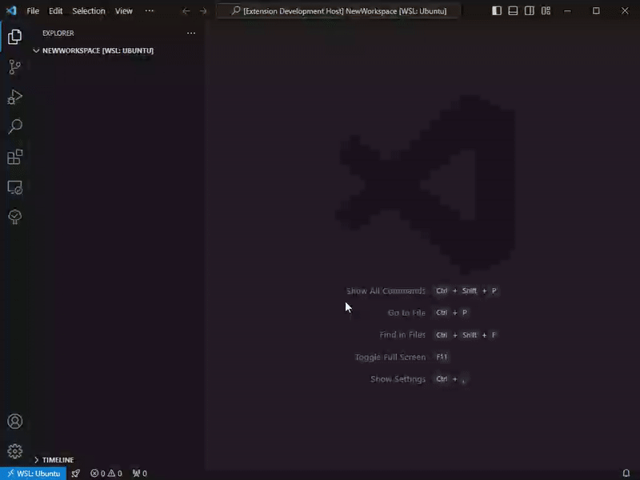

# WorkspaceTime

A simple status bar extension to automatically track time spent in a workspace.

## Features

- A simple timer which opens in the status bar when you open a workspace. Each workspace has its own separate timer.

- Toggle pause/resume on click

- Start, stop, pause, resume, and reset with commands

## Extension Settings

This extension contributes the following settings:
| Setting | Description | Default Value |
| --- | --- | --- |
| `workspacetime.pattern` | The text pattern that will be displayed in the status bar item. `$hours`, `$minutes`, and `$seconds` will be replaced with the corresponding lengths of time. Minutes and seconds will be always be two digits while the number of digits in the hours is variable. `$name` will be replaced with the name of the workspace. | `"$hours:$minutes:$seconds elapsed in $name"` |
| `workspacetime.idleTimeout` | The allowed amount of seconds of inactivity before the timer automatically pauses. | `300` seconds (5 minutes) |
| `workspacetime.startOnOpen` | Whether the timer starts every time a workspace opens. If `false`, then you need to use the `start` command to begin the timer. | `false` |

## Known Issues

None yet. :)

## Release Notes

Users appreciate release notes as you update your extension.

### 1.0.0

Initial release.
- Timer implemented
- Idle timeout implemented